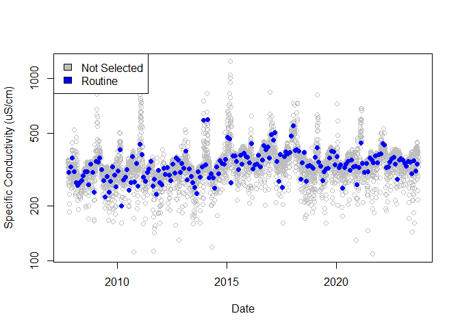
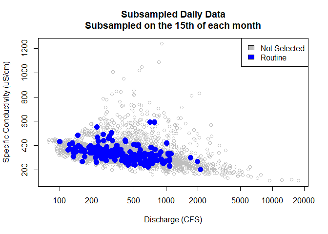
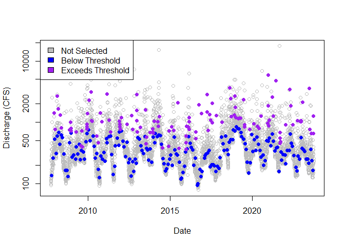
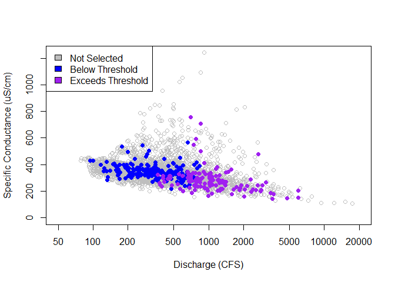
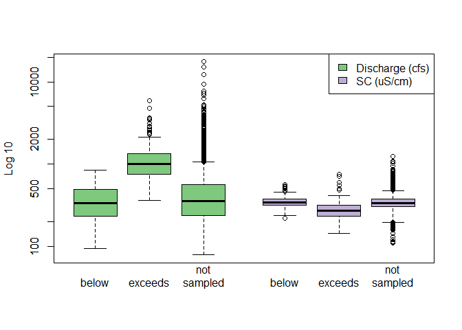
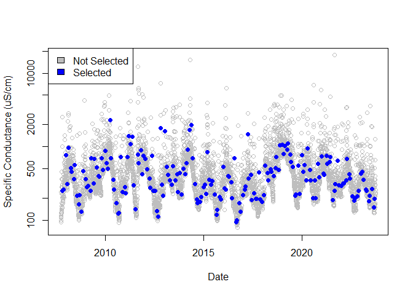
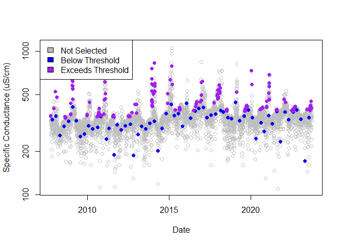
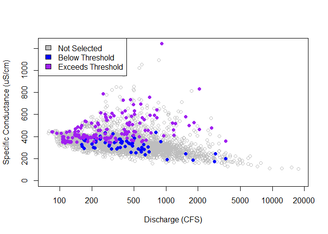
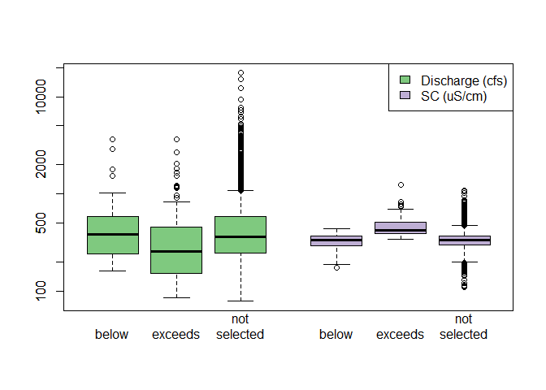

<!-- README.md is generated from README.Rmd. Please edit that file -->

# streamsampler

The goal of `streamsampler` is to provide the ability to perform
periodic and/or stratified subsampling of a water quality record of
daily (or at least very frequent) observations. The water quality record
can be subsampled based on a set frequency, such as the 15th of each
month; or the record can be subsampled using a stratified approach based
on a seasonal threshold of reference measurements, such as discharge,
where observations occurring below and above the threshold are
subsampled according to different parameters. For example, observations
associated with a reference measurement below the threshold, subsampling
is conducted at a specified frequency (e.g., monthly). Observations
associated with a reference measurement exceeding the threshold are
subsampled for each year of the record. Either method results in a
subsampled record that reasonably approximates a water quality record
that would have been produced by physical data collection.

A subsampled water quality record allows a user to apply mathematical,
statistical, and/or modeling techniques to a record with less frequent
observations. For example, a user may find a 30-year record of daily
water quality observations, subsample the record, fit a WRTDS model
(from the `EGRET` package), and then compare the results to the complete
record. A user may also implement `streamsampler` in their methods for
conducting train/test or cross-validation splits in machine learning
modeling.

The streamsampler package can also determine the completeness of a
discharge or water quality record, determine the location of gaps in the
record, and provide the number and proportion of positive and negative
values.

## Installation

Install the released version from CRAN:

``` r
install.packages("streamsampler")
```

Or install the development version from [GitHub](https://github.com/):

``` r
# install.packages("remotes")
remotes::install_github(
  repo = "Kyle-Hurley/streamsampler"
)
```

## Methodology

There are two subsampling methods provided, one that is psuedo-random
and one that is strictly routine. Together, these functions are intended
to subsample a (near) daily water quality record such that the output
resembles water quality sampling strategies described in [Lee et al.,
2016](https://doi.org/10.1016/j.jhydrol.2016.08.059) and [Lee et al.,
2019](https://doi.org/10.3133/sir20195084).

### subsample()

The `subsample()` function is psuedo-random across time in that values
are selected randomly in rolling chunks of time according to a defined
frequency. If, for example, the frequency is weekly and the number of
desired observations to be selected is 1, then the result will be 1
randomly selected observation for each week in the record.

This subsampling method is also stratified by a seasonal reference
threshold. Seasons and the threshold quantile are defined by the user.
Observations with values occurring on dates at or below the associated
seasonally adjusted reference threshold quantile are subsampled
according to the desired number of samples and by the desired frequency.
A user-defined number of observations with values exceeding the
seasonally adjusted reference threshold are selected at random across an
entire year. Control is given to the user over randomly selecting these
“exceeds threshold” values by arguments that change weights and/or
target local maxima.

Most simply, `subsample()` allows a user to e.g. define the seasonal
threshold as the 80%’ile of discharge, randomly select 1 water quality
sample per month where discharge is lower than the discharge threshold,
and randomly select 8 water quality samples per year where discharge is
higher than the discharge threshold.

### subsample_routine()

The `subsample_routine()` function provides a method to select
observations at a regular frequency. These frequencies include days, day
of the week, and months. A user may subsample a provided water quality
record at a specified interval of days (e.g. every 10 days), on a
specified day of the week (e.g. every Tuesday), or on a day of the month
(e.g. 15th of every month).

## Example

This is a basic example which shows you how to examine the completeness
of a record. Both the Specific Conductivity (SC) record and discharge
(q) record in this example start in October of 2007.

``` r
library(streamsampler)

sc_dates <- streamdat[!is.na(streamdat$sc), "date"]
eval_dates(
  dates = sc_dates, 
  rec_start = as.Date("2007-10-01"), 
  rec_end = as.Date("2023-09-30"), 
  by = "day"
)
#>   pct_complete n_miss
#> 1     98.68241     77
```

You can also examine a record for gaps. In this example, the first 6
gaps in the SC record are shown.

``` r
sc_gaps <- find_gaps(dates = sc_dates)
head(sc_gaps)
#>   n_days      start        end location
#> 1      9 2020-08-05 2020-08-13     4626
#> 2      5 2017-11-23 2017-11-27     3658
#> 3      4 2017-12-08 2017-12-11     3668
#> 4      3 2008-10-11 2008-10-13      377
#> 5      3 2019-07-22 2019-07-24     4255
#> 6      2 2012-07-31 2012-08-01     1746
```

With a few lines of code, any gap can be viewed in the parent record.

``` r
gap_start <- which(
  streamdat$date == sc_gaps[1, "start"]
)
gap_end <- which(
  streamdat$date == sc_gaps[1, "end"]
)
streamdat[(gap_start - 1):(gap_end + 1), ]
#>            date    q  sc
#> 4692 2020-08-04 4010 216
#> 4693 2020-08-05 6920  NA
#> 4694 2020-08-06  813  NA
#> 4695 2020-08-07 1840  NA
#> 4696 2020-08-08 2020  NA
#> 4697 2020-08-09  765  NA
#> 4698 2020-08-10  654  NA
#> 4699 2020-08-11  547  NA
#> 4700 2020-08-12  616  NA
#> 4701 2020-08-13  736  NA
#> 4702 2020-08-14  490 276
```

There are several other useful functions offered by `streamsampler`, but
the main functions are `subsample()` and `subsample_routine()`.

To create a subsampled water quality record composed of observations at
a specified frequency, use `subsample_routine()`. For example, subsample
a daily water quality record to a monthly record.

``` r
sroutine <- subsample_routine(
  dates = streamdat$date, values = streamdat$sc, 
  day = 15, freq = "month"
)
df <- merge(streamdat[, -3], sroutine)

plot(
  df[df$selection_type == "not_selected", "date"], 
  df[df$selection_type == "not_selected", "value"], 
  col = "gray", log = "y", 
  xlab = "Date", 
  ylab = "Specific Conductivity (uS/cm)"
)
points(
  df[df$selection_type == "routine", "date"], 
  df[df$selection_type == "routine", "value"], 
  col = "blue", pch = 16
)
legend("topleft", 
  c("Not Selected", "Routine"), 
  fill = c("gray", "blue")
)
```



``` r

plot(
  df$q[df$selection_type == "not_selected"],
  df$value[df$selection_type == "not_selected"],
  pch = 21, col = "gray",
  xlab = "Discharge (CFS)", ylab = "Specific Conductivity (uS/cm)",
  main = paste0("Subsampled Daily Data\nSubsampled on the 15th of each month"),
  log = "x"
)
points(
  df$q[df$selection_type != "not_selected"],
  df$value[df$selection_type != "not_selected"],
  pch = 16, cex = 1.5,
  col = c(
    "routine" = "blue"
  )[df$selection_type[df$selection_type != "not_selected"]]
)
legend(
  "topright",
  legend = c("Not Selected", "Routine"),
  fill = c("gray", "blue")
)
```



The `subsample_routine()` function is a wrapper for the base R function
`seq.Date()`, and therefore does not rely on randomization - meaning,
routine subsampling is non-random and results are reproducible.

The `subsample()` function will perform stratified subsampling to
produce a smaller, representative data set a daily water quality record.
This function does use the base R `sample()` function, therefore a
`seed` parameter (default is 123) is provided to ensure results are
reproducible.

``` r
ss_sc <- subsample(
  dates = streamdat$date, 
  values = streamdat$sc, 
  thresh_ref = streamdat$q
)

not_selected <- ss_sc[ss_sc$selection_type == "not_selected", ]
blw_thresh <- ss_sc[ss_sc$selection_type == "below_threshold", ]
excd_thresh <- ss_sc[ss_sc$selection_type == "exceeds_threshold", ]

# Sampling across dates
plot(
  not_selected$date, not_selected$thresh_ref, 
  col = "gray", log = "y", 
  xlab = "Date", ylab = "Discharge (CFS)"
)
points(
  blw_thresh$date, blw_thresh$thresh_ref, 
  col = "blue", pch = 16
)
points(
  excd_thresh$date, excd_thresh$thresh_ref, 
  col = "purple", pch = 16
)
legend("topleft", 
  c("Not Selected", "Below Threshold", "Exceeds Threshold"), 
  fill = c("gray", "blue", "purple")
)
```



``` r

# Sampling across the threshold reference
plot(
  not_selected$thresh_ref, not_selected$value, 
  log = "x", ylim = c(0, max(ss_sc$value, na.rm = TRUE)), 
  xlim = c(50, 20000), col = "gray", 
  xlab = "Discharge (CFS)", ylab = "Specific Conductance (uS/cm)", 
)
points(
  blw_thresh$thresh_ref, blw_thresh$value, 
  col = "blue", pch = 16
)
points(
  excd_thresh$thresh_ref, excd_thresh$value, 
  col = "purple", pch = 16
)
legend("topleft", 
  c("Not Selected", "Below Threshold", "Exceeds Threshold"), 
  fill = c("gray", "blue", "purple")
)
```



``` r

# Compare spread
ss_sc$q_lab <- "Discharge"
ss_sc$sc_lab <- "SC"
boxplot(
  thresh_ref ~ selection_type + q_lab, data = ss_sc, 
  at = 1:3, 
  xlim = c(0.5, 7.0),
  log = "y",
  col = "#7fc97f", ylab = "Log 10", xlab = "", xaxt = "n"
)
boxplot(
  value ~ selection_type + sc_lab, data = ss_sc, 
  add = TRUE, at = 5:7 - 0.5, xaxt = "n", 
  col = "#beaed4"
)
axis(
  1, at = c(1:3, 5:7 - 0.5), 
  labels = rep(c("below", "exceeds", "not\nsampled"), 2), 
  lwd = 0
)
legend(
  "topright", 
  c("Discharge (cfs)", "SC (uS/cm)"), 
  fill = c("#7fc97f", "#beaed4")
)
```



The default is to subsample for 1 observation that is below the
threshold for each month, and for 8 observations that are above the
threshold for each year, where the threshold is the 80th percentile of
each season (4 seasons starting in October). If the user desires
observations to be selected at random without stratifying the water
quality record, then `threshold` can be set to `1`. A simple example:

``` r
rand_sc <- subsample(
  dates = streamdat$date, 
  values = streamdat$sc, 
  thresh_ref = streamdat$q, 
  threshold = 1
)

not_selected <- rand_sc[rand_sc$selection_type == "not_selected", ]
blw_thresh <- rand_sc[rand_sc$selection_type == "below_threshold", ]

# Sampling across dates
plot(
  not_selected$date, not_selected$thresh_ref, 
  col = "gray", log = "y", 
  xlab = "Date", ylab = "Specific Conductance (uS/cm)"
)
points(
  blw_thresh$date, blw_thresh$thresh_ref, 
  col = "blue", pch = 16
)
legend("topleft", 
  c("Not Selected", "Selected"), 
  fill = c("gray", "blue")
)
```



There are several ways to change the subsampling procedure. In the
example below, SC will be used as the threshold reference instead of
discharge; peaks, based on a 30-day sliding window, will be targeted for
observations exceeding the 90th percentile; the year will be set to
start in January with 3 seasons; and 1 observation below the threshold
per quarter and 10 observations exceeding the threshold per year will be
selected.

``` r
ss_peaks <- subsample(
  dates = streamdat$date, 
  values = streamdat$sc, n_samples = 1, freq = "quarter", 
  thresh_ref = streamdat$sc, threshold = 0.9, n_et_samples = 10, 
  look_behind = 29, look_units = "days", 
  season_start = 1, n_seasons = 3
)

ss_streamdat <- merge(streamdat, ss_peaks[, c("date", "selection_type")])
not_selected <- ss_streamdat[ss_streamdat$selection_type == "not_selected", ]
blw_thresh <- ss_streamdat[ss_streamdat$selection_type == "below_threshold", ]
excd_thresh <- ss_streamdat[ss_streamdat$selection_type == "exceeds_threshold", ]


# Sampling across dates
plot(
  not_selected$date, not_selected$sc, 
  col = "gray", log = "y", 
  xlab = "Date", ylab = "Specific Conductance (uS/cm)"
)
points(
  blw_thresh$date, blw_thresh$sc, 
  col = "blue", pch = 16
)
points(
  excd_thresh$date, excd_thresh$sc, 
  col = "purple", pch = 16
)
legend("topleft", 
  c("Not Selected", "Below Threshold", "Exceeds Threshold"), 
  fill = c("gray", "blue", "purple")
)
```



``` r

# Sampling across the threshold reference
plot(
  not_selected$q, not_selected$sc, col = "gray", 
  log = "x", ylim = c(0, max(ss_sc$value, na.rm = TRUE)), 
  xlab = "Discharge (CFS)", ylab = "Specific Conductance (uS/cm)"
)
points(
  blw_thresh$q, blw_thresh$sc, 
  col = "blue", pch = 16
)
points(
  excd_thresh$q, excd_thresh$sc, 
  col = "purple", pch = 16
)
legend("topleft", 
  c("Not Selected", "Below Threshold", "Exceeds Threshold"), 
  fill = c("gray", "blue", "purple")
)
```



Changing the threshold reference, number of seasons, and the season
start month alters how the data set is stratified.

``` r
# Compare spread
ss_streamdat$q_lab <- "Discharge"
ss_streamdat$sc_lab <- "SC"
boxplot(
  q ~ selection_type + q_lab, data = ss_streamdat, 
  # at = 1:3 - 0.2, 
  at = 1:3, 
  # boxwex = 0.25, 
  xlim = c(0.5, 7.0),
  log = "y",
  col = "#7fc97f", ylab = "", xlab = "", xaxt = "n"
  # names = c("below", "exceeds", "not\nsampled")
)
boxplot(
  sc ~ selection_type + sc_lab, data = ss_streamdat, 
  add = TRUE, at = 5:7 - 0.5, xaxt = "n", 
  col = "#beaed4"
  # names = c("below", "exceeds", "not\nsampled")
)
axis(
  1, at = c(1:3, 5:7 - 0.5), 
  labels = rep(c("below", "exceeds", "not\nselected"), 2), 
  lwd = 0
)
legend(
  "topright", 
  c("Discharge (cfs)", "SC (uS/cm)"), 
  fill = c("#7fc97f", "#beaed4")
)
```



## Reporting bugs

Please consider reporting bugs and asking questions on the Issues page:
<https://github.com/Kyle-Hurley/streamsampler/issues>
